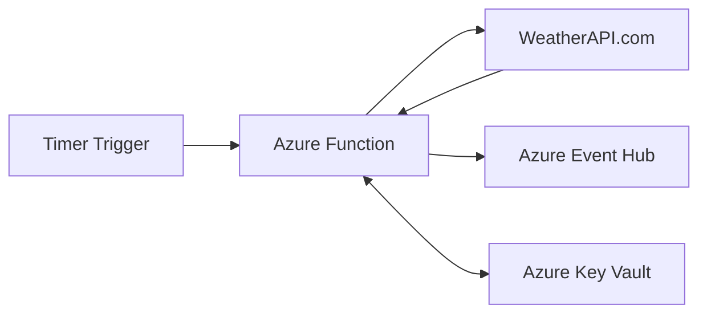

# 🌦️ Weather API Azure Function


## Table of Contents
- [Overview](#overview)
- [Features](#features)
- [Architecture](#architecture)
- [Prerequisites](#prerequisites)
- [Setup and Configuration](#setup-and-configuration)
- [Usage](#usage)
- [API Reference](#api-reference)
- [Security](#security)

## Overview
This Azure Function app fetches real-time weather data from WeatherAPI.com and streams it to Azure Event Hub. The function runs on a timer trigger every 30 seconds, collecting current weather conditions, forecasts, and weather alerts for specified locations.

## Features
- 🕒 Timer-triggered execution (every 30 seconds)
- 🌡️ Real-time weather data collection
- 📊 Air quality monitoring
- ⚡ Weather alerts tracking
- 🔮 3-day weather forecast
- 🔄 Azure Event Hub integration
- 🔐 Secure credentials management using Azure Key Vault

## Architecture


## Prerequisites
- Azure Subscription
- Azure Function App with Python runtime
- Azure Event Hub Namespace and Event Hub
- Azure Key Vault
- WeatherAPI.com API key
- Python 3.8+

## Setup and Configuration
1. **Azure Resources Setup**
   ```bash
   # Create required Azure resources
   az group create --name weather-app-rg --location eastus
   az eventhubs namespace create --name np-weather-streaming-namespace
   az keyvault create --name kv-weather-streaming
   ```

2. **Environment Variables**
   ```python
   EVENT_HUB_NAME = "weatherstreamingeventhub"
   EVENT_HUB_NAMESPACE = "np-weather-streaming-namespace.servicebus.windows.net"
   VAULT_URL = "https://kv-weather-streaming.vault.azure.net/"
   ```

3. **Required Python Packages**
   ```txt
   azure-functions
   azure-eventhub
   azure-identity
   azure-keyvault-secrets
   requests
   ```

## Usage
The function automatically executes every 30 seconds and performs the following operations:
1. Fetches API key from Azure Key Vault
2. Retrieves weather data from WeatherAPI.com including:
   - Current weather conditions
   - Air quality data
   - Weather alerts
   - 3-day forecast
3. Processes and flattens the data
4. Streams the formatted data to Azure Event Hub

## API Reference
### Weather Data Structure
```json
{
    "name": "City Name",
    "region": "Region",
    "country": "Country",
    "lat": "Latitude",
    "lon": "Longitude",
    "localtime": "Local Time",
    "temp_c": "Temperature in Celsius",
    "air_quality": {
        "co": "CO Levels",
        "no2": "NO2 Levels",
        "o3": "O3 Levels"
    },
    "forecast": [
        {
            "date": "Forecast Date",
            "maxtemp_c": "Max Temperature",
            "mintemp_c": "Min Temperature"
        }
    ]
}
```

## Security
- Uses Azure Managed Identity for authentication
- Secure credential storage in Azure Key Vault
- No hardcoded secrets in the code

---
📝 **Note:** Remember to configure appropriate access policies and permissions in Azure Key Vault and Event Hub for the function app's managed identity.

